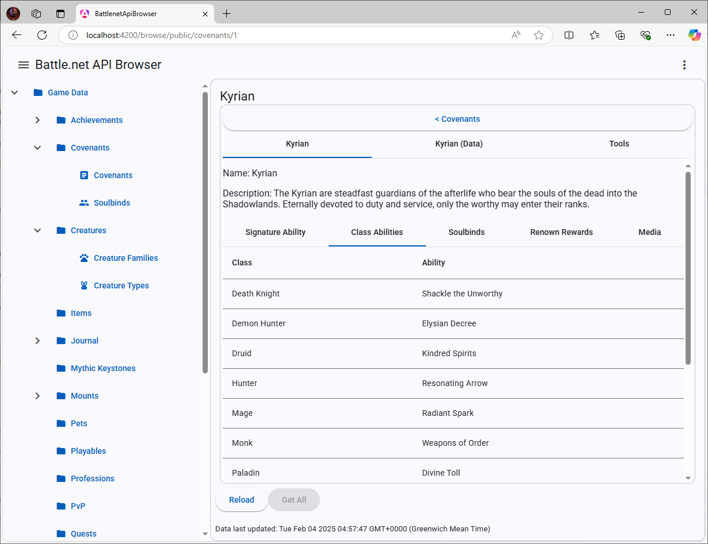

# Battle&#46;NET API Browser

[SPA](https://en.wikipedia.org/wiki/Single-page_application) client for the [Battle.net API](https://develop.battle.net/), written in [Angular](https://angular.dev).

This is a work in progress, many parts of the API are not implemented yet and only have a placeholder folder icon.

View the [changelog](CHANGELOG.md) for details on new releases



## Requirements

### Development and Build

- Node v22.12.0, not tested on earlier versions.  

### Runtime

Tested on Chrome (132.0.6834.110), Firefox (113.0.3), and Edge (132.0.2957.127) running from a local webserver.

Precomplied releases can be found at https://github.com/mthomason12/battlenet-api-browser/releases

Builds are triggered by going to the **battlenet-api-browser** directory and running:

```npm run build``` for the self-hosted version (which will be output to the **dist** folder), you'll need to put this onto a webserver to run it.

```npm run build-electron``` for the Electron version (which will be output to the **out** folder)- this should automatically pick the Electron binary for the platform you're running on.  You can then run this as a local application.

Or if you want to work on the live codebase:

```ng serve``` to serve the Angular application, rebuilding live on file edits.

#### Battle&#46;net Client Registration

Note: You will need to provide your own Battle&#46;net API Key and secret. 
You can get this from the [Battle.net Developer Portal](https://develop.battle.net/access/clients)

When registering your client, you'll need to provide a redirect URL.  If running locally under the defaults, this will be http://localhost:4200/auth-callback

Check "I do not have a service URL for this client"

One item on the [roadmap](#roadmap) is to provide a public API proxy for use by this app.

## Usage

The vast majority of data is left as-is from the Battle.net API.  

However, some things are tweaked for usability, and some are combined.  

For example, exporting "achievements" as JSON will give you an object with both "items" and "details" arrays, with "items" containing the data from getAchievementIndex and "details" containing the individual items from getAchievement.  get....Media calls are automatically run after the applicable query, with the results being appended to a mediaData property on the original item.  The focus is on making it easier for end users, not on matching the API layout 1:1 (if you want that, you can just call the API directly yourself ;) 

## Known Issues

There is currently very little in the way of error checking and handling.  
Any problem with an API call tends to just fail silently other than an error message in the browser console.  The Electron build is only checked intermittently and may be broken at any time (will be adding releases of this soon to provide a ready-built version).

Currently everything is hard-coded to the US region

## Roadmap

- Finish adding API endpoints
- Add a custom browse component for every type of data
- JSON import (allowing backup/restore with JSON files)
- Search function
- Connect to a public API server without needing an API key